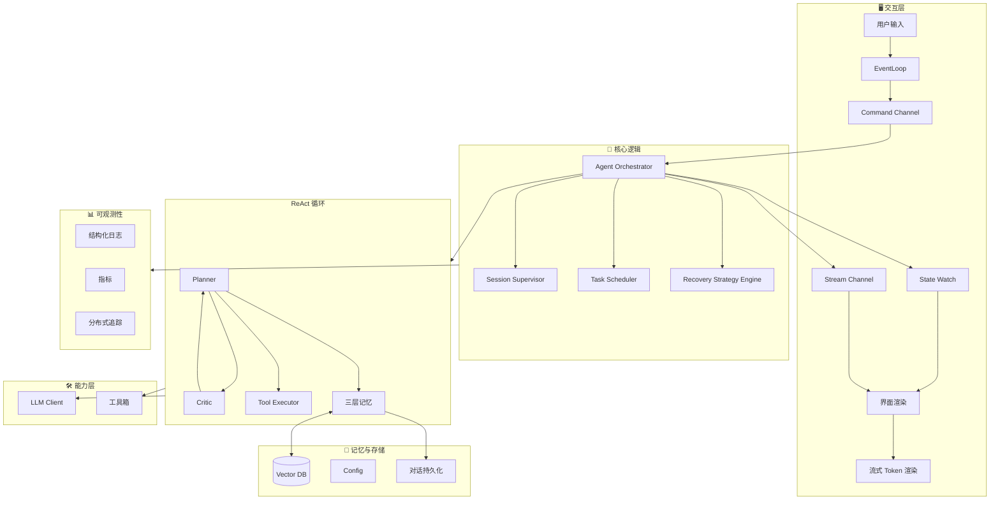

# Rust 个人智能体系统 - 架构分析与完善设计

## 一、原架构分析

### 1.1 优势总结

| 维度 | 评价 | 说明 |
|------|------|------|
| **分层清晰** | ✅ 优秀 | 四层架构（UI / Core / Capabilities / Memory）职责分明 |
| **并发模型** | ✅ 优秀 | Tokio + MPSC/Watch Channel 符合 Rust 异步生态 |
| **ReAct 模式** | ✅ 正确 | Think → Act → Observe 循环是 Agent 标准范式 |
| **安全性** | ✅ 优秀 | Rust 类型系统 + 白名单机制天然适配工具执行 |
| **技术选型** | ✅ 合理 | Ratatui、async-openai、Qdrant 均为成熟方案 |

### 1.2 潜在问题与缺口

| 问题 | 严重程度 | 描述 |
|------|----------|------|
| **错误恢复机制缺失** | 高 | LLM 超时、工具执行失败、JSON 解析错误时无明确恢复路径 |
| **流式输出未体现** | 高 | 用户体验需 Token 流式渲染，架构未显式设计 |
| **状态持久化不完整** | 中 | 对话中断后恢复、上下文冷启动未考虑 |
| **可观测性不足** | 中 | 日志、指标、Trace 对调试和监控至关重要 |
| **工具执行隔离** | 中 | 沙箱、超时、资源限制未在架构中体现 |
| **多模态支持** | 低 | 未来扩展（图片、语音）需预留接口 |
| **配置热更新** | 低 | System Prompt 等运行时调整能力 |

---

## 二、完善后的系统架构

### 2.1 整体架构图（增强版）



### 2.2 新增/增强模块说明

#### 2.2.1 错误恢复层 (Error Recovery)

```
设计要点:
├── LLM 调用失败 → 重试（指数退避）或降级到本地模型
├── 工具执行超时 → 取消任务 + 向用户反馈
├── JSON 解析失败 → 请求 LLM 重新格式化输出
└── 网络断开 → 队列缓冲 + 重连后继续
```

**建议实现**：
- 使用 `tokio::time::timeout` 包装所有外部调用
- 定义 `AgentError` 枚举，区分可恢复/不可恢复
- 实现 `RetryPolicy` trait，支持不同策略

#### 2.2.2 流式输出通道 (Streaming Pipeline)

```
用户输入 → Planner 构建 Prompt
         → LLM 流式 API (SSE/Stream)
         → Token 聚合缓冲 (可选)
         → Watch Channel 推送 UI
         → Ratatui 增量渲染
```

**关键点**：
- `async-openai` 支持 `chat().create_stream()` 返回 `Stream`
- UI 侧需 `tokio::select!` 同时监听：用户输入、Token 流、状态更新
- 建议 Token 缓冲（如 16 个字符）再刷新，减少渲染压力

#### 2.2.3 工具执行沙箱 (Tool Sandbox)

```
ToolExecutor
├── 白名单: 允许的路径、命令、域名
├── 超时: 每工具独立 timeout (默认 30s)
├── 资源限制: 内存、CPU (可选，需 OS 支持)
└── 审计日志: 记录每次工具调用
```

**Rust 实现建议**：
- 使用 `std::path::Path::strip_prefix` 限制文件访问范围
- Shell 命令通过 `which` 白名单 + 参数校验
- 考虑 `gvisor` 或 `bubblewrap` 做深度隔离（可选）

#### 2.2.4 可观测性 (Observability)

```
日志: tracing + tracing-subscriber (JSON 格式，适合采集)
指标: 请求延迟、Token 用量、工具调用次数
Trace: 单次对话的完整链路（Planner → LLM → Tool → 响应）
```

**依赖建议**：
```toml
tracing = "0.1"
tracing-subscriber = { version = "0.3", features = ["env-filter"] }
metrics = "0.21"  # 或 opentelemetry
```

#### 2.2.5 对话持久化 (Conversation Persistence)

```
冷启动恢复:
├── 会话 ID → 加载最近 N 轮对话到 Context Window
├── 可选: 向量化历史消息入 Vector DB
└── 断点续传: 保存中间状态（如 ReAct 循环中的 step）
```

**存储格式**：建议 MessagePack 或 SQLite（轻量、可查询）

---

### 2.3 架构级补强（生产级演进）

#### 2.3.1 Orchestrator 调度权：Session Supervisor + Task Scheduler

**隐含问题**：单一 Orchestrator 在以下场景会被拉爆：

- 多 Agent（Planner / Critic / Executor）
- Background Task（索引、总结、Embedding）
- 并行 Tool 执行（搜索 + 文件读取同时进行）
- 用户中断 / Cancel / Rollback

**建议**：引入 **Task Scheduler** 概念，将 Orchestrator 拆分为：

```
Orchestrator
├── Session Supervisor（会话级）
│   ├── Agent Loop 生命周期
│   ├── Streaming Control（流控）
│   └── Cancel / Pause（用户 Ctrl+C / Stop generating）
│
└── Task Scheduler（任务级）
    ├── Foreground Task（ReAct 主循环）
    ├── Background Task（Embedding / Index / 总结）
    └── Tool Task Pool（受限并发，如最多 3 个并行工具）
```

**Rust 实现建议**：

```rust
use tokio_util::sync::CancellationToken;

#[derive(Clone, Copy, PartialEq, Eq, Hash)]
pub enum TaskKind {
    AgentStep,      // 前台，阻塞 UI
    ToolExecution,  // 前台/后台，可并行
    Background,     // 后台，不阻塞
}

pub struct Task {
    pub id: TaskId,
    pub kind: TaskKind,
    pub cancel_token: CancellationToken,
}
```

> 📌 **关键**：`CancellationToken` 是未来「用户 Ctrl+C / Stop generating」的基础。

#### 2.3.2 Recovery Strategy Engine（错误 = 反馈信号）

错误不是「兜底」，而是**有语义的反馈**。不同错误应触发不同恢复策略：

| 错误类型 | 推荐恢复策略 |
|----------|--------------|
| JSON Parse Error | `Reformulate` + 强 schema 约束 |
| Tool Timeout | `Retry`（一次）→ `AskUserClarification` |
| Context Too Long | `Summarize` + `Retry` |
| LLM Hallucinated Tool | `Reject` + `ToolSpecReinforce` |
| 网络断开 | `Retry`（指数退避）→ `AbortGracefully` |

**Rust 实现建议**：

```rust
pub enum RecoveryAction {
    Retry { with_prompt_fix: bool },
    Reformulate,           // 要求 LLM 重新格式化输出
    DowngradeModel,        // 降级到本地/更小模型
    AskUserClarification,  // 向用户确认
    AbortGracefully,       // 优雅终止
}

impl RecoveryStrategyEngine {
    pub fn decide(&self, error: &AgentError) -> RecoveryAction {
        // 根据错误语义选择策略
    }
}
```

#### 2.3.3 Channel 语义分级（避免 Token 洪水阻塞 State）

| 通道 | 用途 | 类型 | 说明 |
|------|------|------|------|
| **Command** | 用户/系统指令 | MPSC | 用户输入、Cancel、Pause |
| **State** | Agent 状态 | Watch | 低频，UI 订阅用于渲染 |
| **Stream** | Token / Partial 文本 | Broadcast 或 bounded MPSC | 高频、小粒度、**可丢弃** |
| **Event** | 日志 / Trace | Unbounded | 不阻塞主流程 |

**关键**：Stream 与 State **必须分离**，否则 UI 会因 Token 洪水而无法及时收到状态更新（如「正在执行工具」）。

---

### 2.4 Agent 能力进化（拉开段位差距）

#### 2.4.1 Planner + Critic（Plan-Act-Observe-Critic-Refine）

典型 ReAct：`Think → Act → Observe`。

高质量 Agent：在 Observe 后增加 **Critic** 环节：

```
Plan → Act → Observe → Critic（是否合理？是否偏离目标？）→ Refine Plan
```

**实现成本极低，收益极高**：

```rust
#[async_trait]
pub trait AgentRole {
    async fn run(&self, ctx: AgentContext) -> AgentOutput;
}

pub struct Planner;
pub struct Critic;
pub struct Executor;
```

Critic 的 Prompt 示例：

> "检查上一步的 reasoning / tool usage 是否合理，是否偏离用户目标。如不合理，给出修正建议；如合理，输出 APPROVED。"

**实测效果**：Tool 幻觉 ↓、死循环 ↓、ReAct 次数 ↓。

#### 2.4.2 三层记忆（History ≠ Context Window）

**隐性 bug**：许多 Agent 把「最近 N 条消息」等同于「完整上下文」，导致 LLM 重复犯错。

**建议拆成 3 层**：

| 层级 | 名称 | 内容 | 生命周期 |
|------|------|------|----------|
| **短期** | Conversation Memory | 最近 N 轮对话 | 单会话 |
| **中期** | Working Memory | 当前任务目标、已尝试方案、失败原因 | 单任务 |
| **长期** | Long-term Memory | 向量化知识、用户偏好 | 跨会话 |

在 Prompt 中**显式区分**：

```
## Current Goal
{working_memory.goal}

## What has been tried
{working_memory.attempts}

## Relevant Past Knowledge
{long_term_retrieval}
```

显著减少「重复尝试失败方案」的现象。

---

### 2.5 Rust 工程化：数据与视图分离

#### InternalState vs UI State（投影模式）

Core 侧维护 **InternalState**（完整内部状态），UI 只接收 **投影（Projection）**：

```rust
/// Core 内部状态（不暴露给 UI）
pub struct InternalState {
    pub step: usize,
    pub retries: u8,
    pub context_tokens: usize,
    pub current_tool: Option<ToolCall>,
    pub cancel_token: CancellationToken,
    // ...
}

/// UI 投影（轻量、可序列化）
#[derive(Clone, Serialize)]
pub struct UiState {
    pub phase: AgentPhase,  // Idle | Thinking | Streaming | ToolCalling | ...
    pub partial_response: Option<String>,
    pub tool_name: Option<String>,
    pub error_message: Option<String>,
}

impl InternalState {
    pub fn project(&self) -> UiState {
        // 内部状态 → UI 投影
    }
}
```

**收益**：未来做 Web UI / HTTP API / TUI 时，**Core 无需重写**。

---

## 三、状态机设计（细化）

```
                    ┌─────────────┐
                    │   Idle      │◄───────────────────┐
                    │ 等待用户输入  │                    │
                    └──────┬──────┘                    │
                           │ 用户发送消息               │
                           ▼                           │
                    ┌─────────────┐                    │
                    │  Thinking   │                    │
                    │  LLM 推理中  │                    │
                    └──────┬──────┘                    │
              ┌────────────┼────────────┐              │
              │            │            │              │
              ▼            ▼            ▼              │
       ┌──────────┐ ┌──────────┐ ┌──────────┐         │
       │ Respond  │ │ ToolCall │ │  Error   │         │
       │ 直接回复   │ │ 执行工具  │ │ 需恢复   │─────────┘
       └────┬─────┘ └────┬─────┘ └──────────┘
            │            │
            │            ▼
            │     ┌──────────────┐
            │     │  Executing   │
            │     │  工具执行中   │
            │     └──────┬───────┘
            │            │ 返回 Observation
            │            ▼
            │     ┌──────────────┐
            └────►│   Thinking   │ (下一轮 ReAct)
                  └──────────────┘
```

**状态定义示例**（UI 投影用）：

```rust
/// UI 侧使用的状态（投影）
#[derive(Debug, Clone, PartialEq, Serialize)]
pub enum AgentPhase {
    Idle,
    Thinking { prompt_tokens: u32 },
    Streaming { partial_response: String },
    ToolCalling { tool: String, args: serde_json::Value },
    Responding { full_response: String },
    Error { kind: ErrorKind, message: String },
}

/// Core 侧完整状态（见 2.5 节 InternalState）
```

---

## 四、长期演进路线

```
Phase 1（当前）
    └── 本地 TUI 单 Agent

Phase 2
    └── Headless Agent Runtime + CLI / HTTP API
        （TUI 仅作为前端之一）

Phase 3
    └── Multi-Agent（Planner / Critic / Researcher 分工）

Phase 4
    └── Tool Marketplace + 权限系统

Phase 5
    └── 本地 Agent OS（长期运行、任务队列、定时触发）
```

> 📌 **评估**：当前架构与目录结构**可支撑至 Phase 4**，无需大改。

---

## 五、依赖选型建议

| 模块 | 推荐库 | 版本 | 备选 |
|------|--------|------|------|
| 异步运行时 | tokio | 1.x | - |
| TUI 框架 | ratatui | 0.28+ | - |
| 终端抽象 | crossterm | 0.28 | - |
| LLM 客户端 | async-openai | 0.32+ | ollama-rs (本地) |
| 向量数据库 | qdrant-client | 1.x | lancedb (嵌入式) |
| 配置 | config + serde | - | - |
| 日志 | tracing | 0.1 | - |
| 序列化 | serde + serde_json | - | - |
| HTTP 客户端 | reqwest | 0.12 | (async-openai 内置) |

**LLM 多后端抽象**：建议定义 `LlmBackend` trait，实现 `OpenAiBackend` 和 `OllamaBackend`，便于切换。

**取消与调度**：
```toml
tokio_util = { version = "0.7", features = ["sync"] }  # CancellationToken
```

---

## 六、目录结构建议

```
bee/
├── Cargo.toml
├── config/
│   ├── default.toml
│   └── prompts/
│       ├── system.txt
│       ├── tool_calling.txt
│       └── critic.txt
├── src/
│   ├── main.rs
│   ├── lib.rs
│   ├── ui/                    # 交互层
│   │   ├── mod.rs
│   │   ├── app.rs
│   │   ├── event.rs
│   │   └── render.rs
│   ├── core/                  # 核心逻辑
│   │   ├── mod.rs
│   │   ├── orchestrator.rs
│   │   ├── session_supervisor.rs  # 会话级生命周期
│   │   ├── task_scheduler.rs      # 任务调度
│   │   ├── state.rs               # InternalState + UiState
│   │   ├── error.rs
│   │   └── recovery.rs            # Recovery Strategy Engine
│   ├── react/                 # ReAct 循环
│   │   ├── mod.rs
│   │   ├── planner.rs
│   │   ├── critic.rs              # Critic 角色
│   │   ├── memory.rs              # 三层记忆
│   │   └── loop.rs
│   ├── llm/                   # LLM 抽象
│   │   ├── mod.rs
│   │   ├── trait.rs
│   │   ├── openai.rs
│   │   └── ollama.rs
│   ├── tools/                 # 工具箱
│   │   ├── mod.rs
│   │   ├── executor.rs
│   │   ├── filesystem.rs
│   │   ├── shell.rs
│   │   └── search.rs
│   ├── memory/                # 记忆与存储
│   │   ├── mod.rs
│   │   ├── conversation.rs       # 短期记忆
│   │   ├── working.rs            # 中期记忆
│   │   ├── long_term.rs          # 长期记忆 + Vector Store
│   │   └── persistence.rs
│   └── observability/
│       ├── mod.rs
│       └── tracing.rs
└── docs/
    └── ARCHITECTURE_ANALYSIS.md  # 本文档
```

---

## 七、实施优先级建议

| 阶段 | 内容 | 预估 |
|------|------|------|
| **P0** | 基础架构：main loop、UI 骨架、Channel 分级（Command/State/Stream） | 1-2 天 |
| **P0** | LLM 集成（async-openai）+ 简单 ReAct 循环 | 2-3 天 |
| **P1** | 工具箱：文件读写、Shell（白名单） | 1-2 天 |
| **P1** | 流式输出 + InternalState/UiState 投影 | 1-2 天 |
| **P1** | Planner + Critic（Plan-Act-Observe-Critic） | 1 天 |
| **P2** | Task Scheduler + CancellationToken（用户中断） | 1 天 |
| **P2** | Recovery Strategy Engine（语义化错误恢复） | 1 天 |
| **P2** | 可观测性（tracing） | 0.5 天 |
| **P3** | 三层记忆（Conversation/Working/Long-term） | 2-3 天 |
| **P3** | Vector DB + 对话持久化 | 2-3 天 |
| **P3** | 配置热更新、多后端切换 | 1 天 |

---

## 八、总结

本文档从「个人智能体」起步，演进为**可支撑生产级 Agent Runtime 的架构蓝图**。主要补充与优化如下：

### 基础层（第一版完善）

1. **错误恢复**：确保异常场景下系统可降解、可恢复  
2. **流式输出**：提升响应体感和交互流畅度  
3. **工具沙箱**：明确安全边界与审计能力  
4. **可观测性**：便于调试与生产监控  
5. **状态机细化**：使 UI 与 Core 的同步更清晰  
6. **持久化与冷启动**：支持长对话与断点续传  

### 架构级补强（生产级演进）

7. **Orchestrator 调度权**：Session Supervisor + Task Scheduler，支持 Cancel、并行工具、后台任务  
8. **Recovery Strategy Engine**：错误 = 反馈信号，语义化恢复策略  
9. **Channel 分级**：Command / State / Stream / Event 分离，避免 Token 洪水阻塞  

### Agent 能力进化（拉开段位差距）

10. **Planner + Critic**：Plan-Act-Observe-Critic-Refine，降低幻觉与死循环  
11. **三层记忆**：Conversation / Working / Long-term，减少重复犯错  
12. **数据与视图分离**：InternalState + UiState 投影，Core 与前端解耦  

### 长期演进

架构与目录结构**可支撑至 Phase 4**（Tool Marketplace + 权限系统），为 Phase 5（本地 Agent OS）预留扩展空间。

> 这不是「写个 Agent 玩玩」的设计，而是 **一个 Rust 原生 Agent Runtime 的蓝图**。
