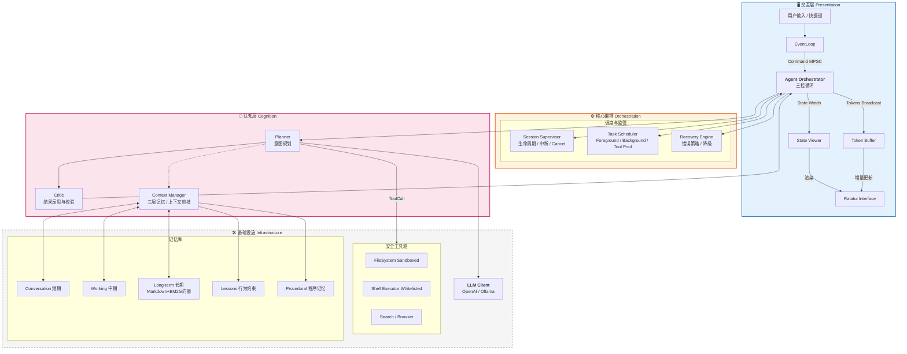

# Rust 个人智能体系统 (Bee) - 架构设计白皮书

## 1. 核心设计理念

本系统（代号 **Bee**）旨在构建一个高性能、安全且具备长期记忆的个人智能体。设计遵循以下原则：

1. **Rust Native**：充分利用 Rust 的所有权模型（Ownership）保证内存安全，利用 Tokio 实现高并发 I/O。
2. **Safety First**：工具执行层必须具备沙箱隔离，杜绝 AI「幻觉」导致的系统性破坏。
3. **Responsiveness**：UI 渲染与 AI 推理彻底解耦，确保在繁重的推理任务中界面依然流畅。
4. **Cognitive Loop**：采用 `Plan -> Act -> Observe -> Critic` 的增强型 ReAct 循环，提升解决复杂任务的能力。
5. **Self-Evolution**：通过本地记忆（Lessons、程序记忆、长期摘要）与 Context Compaction，让 Agent 在不改代码的前提下「越用越听话、越少重复错」（参见 `docs/EVOLUTION.md`）。

---

## 2. 系统架构图 (Enhanced Architecture)

我们引入了 **Session Supervisor**（会话监管）、**Task Scheduler**（任务调度）和 **Recovery Engine**（恢复引擎）来增强系统的稳定性与可控性。



---

## 3. 关键模块详细设计

### 3.1 核心编排 (Orchestrator) 与通信管道

UI 与 Core 之间通过三种 Channel 解耦，**Stream 与 State 分离**，避免 Token 洪水阻塞状态更新。

| 通道名称 | 类型 | 方向 | 用途 | 丢包策略 |
|----------|------|------|------|----------|
| `cmd_tx` | `mpsc::unbounded_channel` | UI -> Core | 用户指令 (Submit, Cancel, Clear) | 不可丢 |
| `state_tx` | `watch::channel` | Core -> UI | 完整状态快照 (UiState) | 只保留最新 |
| `stream_tx` | `broadcast::channel` | Core -> UI | LLM 生成的 Token 流 | 可丢弃（UI 卡顿时可跳帧） |

**数据结构定义 (Rust)：**

```rust
// UI 看到的「投影」状态，轻量且易于渲染
#[derive(Clone, Debug, Serialize)]
pub struct UiState {
    pub phase: AgentPhase,           // Idle, Thinking, ToolExecuting, Error
    pub history: Vec<Message>,       // 当前显示的对话记录
    pub active_tool: Option<String>, // 正在使用的工具名称
    pub input_locked: bool,          // 是否锁住输入框
}

// 核心持有的完整内部状态（不暴露给 UI）
pub struct InternalState {
    pub step: usize,
    pub retries: u8,
    pub context_tokens: usize,
    pub memory: MemoryManager,
    pub tool_box: ToolBox,
    pub llm_client: LlmClient,
    pub config: Config,
    pub cancel_token: CancellationToken, // 用户 Ctrl+C 时取消
    // ... 复杂类型，不易克隆
}

impl InternalState {
    pub fn project(&self) -> UiState { /* 投影 */ }
}
```

### 3.2 Session Supervisor 与 Task Scheduler

**Session Supervisor**：管理会话级生命周期，支持 `Cancel` / `Pause`，依赖 `tokio_util::sync::CancellationToken` 实现用户「Stop generating」。

**Task Scheduler**：将任务按优先级与类型分类调度：

| 任务类型 | 说明 | 并发策略 |
|----------|------|----------|
| Foreground | ReAct 主循环 | 串行 |
| Tool Execution | 工具调用 | 受限并行（如最多 3 个） |
| Background | Embedding、索引、总结 | 后台队列，不阻塞 UI |

```rust
use tokio_util::sync::CancellationToken;

#[derive(Clone, Copy, PartialEq, Eq, Hash)]
pub enum TaskKind {
    AgentStep,      // 前台
    ToolExecution,  // 可并行
    Background,     // 后台
}

pub struct Task {
    pub id: TaskId,
    pub kind: TaskKind,
    pub cancel_token: CancellationToken,
}
```

### 3.3 增强型 ReAct 循环 (Planner + Critic)

在标准 `Think -> Act -> Observe` 中插入 **Critic**，降低工具幻觉与死循环。

**流程：**

1. **Planner**：根据用户输入生成执行计划（JSON）。
2. **Tool Execution**：执行工具，获取 `Observation`。
3. **Critic**：在将 `Observation` 喂回 Planner 之前，进行一次轻量级 LLM 调用。
   - **Prompt**：*"用户想要 X，你刚才执行了工具 Y，结果是 Z。这个结果符合预期吗？如不符合，给出修正建议；如符合，输出 OK。"*
4. **Refinement**：若 Critic 给出修正建议，将其作为 Context 注入下一轮，防止 Planner 重蹈覆辙。

**实现建议：**

```rust
#[async_trait]
pub trait AgentRole {
    async fn run(&self, ctx: AgentContext) -> AgentOutput;
}

pub struct Planner;
pub struct Critic;
pub struct Executor;
```

### 3.4 三层记忆与持久化 (Memory)

| 层级 | 名称 | 内容 | 实现与生命周期 |
|------|------|------|----------------|
| **短期** | Conversation Memory | 最近 N 轮对话 | `ConversationMemory`，单会话；可被 Context Compaction 替换为摘要 |
| **中期** | Working Memory | 当前任务目标、已尝试方案、失败原因 | `WorkingMemory`，单任务 |
| **长期** | Long-term Memory | 知识、摘要、用户偏好 | `FileLongTerm`（`memory/long-term.md` + BM25 检索），跨会话；可扩展向量检索 |
| **行为约束** | Lessons | 规则与教训 | `memory/lessons.md`，人工或 HallucinatedTool 时自动追加，规划时整块注入 system |
| **程序记忆** | Procedural | 工具成功/失败经验 | `memory/procedural.md`，工具失败时自动追加，规划时注入 system |
| **用户偏好** | Preferences | 显式「记住：xxx」 | `memory/preferences.md`，识别「记住：」后写入并同步长期，规划时注入 system |

**持久化布局（workspace 下）：**

- `memory/logs/YYYY-MM-DD.md`：按日短期日志，供 `consolidate_memory` 整理入长期。
- `memory/long-term.md`：长期记忆块，按 `## 时间戳` 分块，BM25 风格检索。
- `memory/lessons.md`：行为约束/教训，人工或 HallucinatedTool 时自动追加（`append_hallucination_lesson`）。
- `memory/procedural.md`：程序记忆，工具失败时自动追加（`append_procedural_record`）。
- `memory/preferences.md`：用户偏好，用户说「记住：xxx」时自动追加（`append_preference`）并写入长期。

**Context Manager** 拼装动态 system 时包含：`working_memory_section`、`long_term_section(query)`、`lessons_section()`、`procedural_section()`、`preferences_section()`，从而在 Prompt 中显式区分，减少 LLM 重复犯错：

```
## Current Goal
{working_memory.goal}

## What has been tried
{working_memory.attempts}

## Relevant Past Knowledge
{long_term_retrieval}

## 行为约束 / Lessons（请遵守）
{lessons}

## 程序记忆 / 工具使用经验（请参考，避免重复失败）
{procedural}

## 用户偏好 / Preferences（请遵守）
{preferences}
```

**Context Compaction（上下文压缩）**：当对话条数超过阈值（如 24）时，在规划前自动执行：用 LLM 对当前对话生成摘要 → 写入长期记忆 → 将当前消息替换为一条「Previous conversation summary」的 system 消息（`ConversationMemory::set_messages`），避免 token 溢出。亦可手动触发：Web API `POST /api/compact`，详见 `docs/EVOLUTION.md`。

### 3.5 错误恢复引擎 (Recovery Engine)

利用 Rust 的 `Result` 类型系统构建语义化恢复机制。

```rust
pub enum AgentError {
    NetworkTimeout,
    ContextWindowExceeded,
    JsonParseError(String),
    ToolExecutionFailed(String),
    ToolTimeout(String),
    HallucinatedTool(String), // LLM 调用了不存在的工具
}

pub enum RecoveryAction {
    RetryWithPrompt(String),
    SummarizeAndPrune,
    AskUser(String),
    DowngradeModel,
    Abort,
}

impl RecoveryEngine {
    pub async fn handle(&self, err: AgentError, history: &mut Vec<Message>) -> RecoveryAction {
        match err {
            AgentError::JsonParseError(raw) => {
                RecoveryAction::RetryWithPrompt(
                    format!("上一轮输出的 JSON 格式错误: {raw}。请修正。")
                )
            }
            AgentError::ContextWindowExceeded => RecoveryAction::SummarizeAndPrune,
            AgentError::HallucinatedTool(name) => {
                RecoveryAction::AskUser(
                    format!("模型试图调用不存在的工具 '{name}'，是否需要安装或跳过？")
                )
            }
            AgentError::ToolTimeout(_) => RecoveryAction::AskUser("工具执行超时，是否重试？".into()),
            _ => RecoveryAction::Abort,
        }
    }
}
```

### 3.6 工具沙箱 (Sandboxed Tooling)

| 工具 | 安全策略 |
|------|----------|
| **FileSystem** | 封装 `SafeFs`，初始化时绑定 `root_dir`，所有路径通过 `path.strip_prefix(root_dir)` 校验，禁止 `../../ssh/id_rsa` |
| **Shell** | 维护 `AllowList`，仅允许 `ls`、`grep`、`cargo check` 等，禁止 `rm -rf`、`wget`、`chmod` |
| **Search/Web** | 域名白名单、请求超时、结果大小限制 |

**通用要求**：每工具独立 `timeout`（默认 30s）、审计日志记录每次调用。

---

## 4. 技术栈选型 (BOM)

| 模块 | 推荐库 | 版本要求 | 选择理由 |
|------|--------|----------|----------|
| **Runtime** | `tokio` | 1.35+ | 事实标准，features = ["full"] |
| **Cancel** | `tokio_util` | 0.7+ | `CancellationToken` 支持用户中断 |
| **TUI** | `ratatui` | 0.28+ | 现代、社区活跃，组件丰富 |
| **Input** | `crossterm` | 0.27+ | 跨平台终端事件 |
| **LLM** | `async-openai` | 0.20+ | 类型完善，支持 Stream |
| **JSON** | `serde_json` + `schemars` | 1.0+ | 自动生成工具 Schema |
| **Config** | `config` | 0.14+ | TOML/YAML/Env 分层配置 |
| **Logs** | `tracing` + `tracing-appender` | 0.1+ | 异步非阻塞，结构化输出 |
| **Vector** | `qdrant-client` | 1.9+ | Rust 原生，支持本地模式 |
| **Error** | `thiserror` / `anyhow` | - | 库用 thiserror，应用用 anyhow |

---

## 5. 目录结构

```
bee/
├── Cargo.toml
├── config/
│   ├── default.toml
│   └── prompts/
│       └── system.txt
├── src/
│   ├── main.rs
│   ├── lib.rs
│   ├── agent.rs                  # Headless Agent：create_agent_components、create_context_with_long_term、process_message
│   ├── bin/
│   │   └── web.rs                # bee-web：HTTP API、流式聊天、/api/compact、会话持久化
│   ├── ui/                      # 交互层（TUI）
│   │   ├── mod.rs
│   │   ├── app.rs
│   │   ├── event.rs
│   │   └── render.rs
│   ├── core/                    # 核心编排
│   │   ├── mod.rs
│   │   ├── orchestrator.rs
│   │   ├── error.rs
│   │   ├── recovery.rs
│   │   └── ...
│   ├── react/                   # 认知层
│   │   ├── mod.rs
│   │   ├── planner.rs            # 含 summarize() 用于 Context Compaction
│   │   ├── critic.rs
│   │   ├── memory.rs            # ContextManager：working + long_term + lessons + procedural + set_messages
│   │   └── loop_.rs             # react_loop、compact_context
│   ├── llm/
│   ├── tools/
│   │   ├── mod.rs
│   │   ├── executor.rs
│   │   ├── cat.rs, ls.rs, shell.rs, search.rs, echo.rs
│   │   └── ...
│   ├── memory/                  # 记忆存储
│   │   ├── mod.rs
│   │   ├── conversation.rs      # 含 set_messages（Compaction 用）
│   │   ├── working.rs
│   │   ├── long_term.rs
│   │   ├── markdown_store.rs    # memory 路径、lessons/procedural 读写、consolidate_memory
│   │   └── persistence.rs
│   └── ...
├── static/
│   └── index.html               # Web UI
└── docs/
    ├── Rust个人智能体系统(Bee)-架构设计白皮书.md
    ├── EVOLUTION.md              # 自我进化设计及已实现：Lessons、程序记忆、Context Compaction
    ├── MEMORY.md
    ├── WEBUI.md
    └── ...
```

---

## 5.1 实现状态对照（白皮书 vs 代码）

以下为白皮书中描述与当前代码的对照，便于按图索骥补齐。

| 模块 / 能力 | 白皮书描述 | 当前状态 | 说明 |
|-------------|------------|----------|------|
| **§3.1 通信管道** | cmd_tx / state_tx / stream_tx 三通道 | ✅ 已实现 | Orchestrator 使用 mpsc::Command、watch::UiState、broadcast::Token |
| **§3.1 UiState** | phase, history, active_tool, input_locked | ✅ 已实现 | `core/state.rs`，另有 error_message |
| **§3.1 InternalState** | 完整内部状态 + project() | ✅ 已实现 | `core` 中提供白皮书命名：`MemoryManager` = ContextManager，`ToolBox` = ToolExecutor，`InternalState` = InternalStateSnapshot（投影源）；memory/tool_box 由 Orchestrator 分别持有 |
| **§3.2 Session Supervisor** | Cancel / Pause、CancellationToken | ✅ 已实现 | `SessionSupervisor` + 用户 Cancel 触发取消 |
| **§3.2 Task Scheduler** | Foreground / ToolExecution / Background 调度 | ✅ 已实现 | ReAct 循环在工具执行前调用 `task_scheduler.acquire_tool().await`；Orchestrator 与 AgentComponents 均创建并传入 `TaskScheduler::default()`（工具并发上限 3） |
| **§3.3 Critic** | 工具结果后 LLM 校验 + 修正建议注入下一轮 | ✅ 已实现 | 工具执行得到 Observation 后调用 `Critic::evaluate(goal, tool, observation)`；若返回 `Correction(s)` 则注入一条 user 消息「Critic 建议：…」再写回 Tool call / Observation |
| **§3.4 记忆与持久化** | 三层 + Lessons + Procedural + Preferences + Compaction | ✅ 已实现 | 见 §7、§3.4 |
| **§3.5 Recovery SummarizeAndPrune** | ContextWindowExceeded → 压缩后继续 | ✅ 已实现 | react_loop 匹配 `SummarizeAndPrune` 时调用 `compact_context(planner, context)` 后 `continue` 重试 |
| **§3.5 Recovery DowngradeModel** | 降级模型 | ✅ 已实现 | `RecoveryEngine` 对 `LlmError` 返回 `DowngradeModel`；react_loop 返回 `Err(AgentError::SuggestDowngradeModel(...))` 供上层提示切换轻量模型 |
| **§3.6 工具沙箱** | SafeFs、Shell 白名单、Search 域名 | ✅ 已实现 | SafeFs.resolve 防逃逸；Shell AllowList；Search 白名单 |
| **§3.6 审计日志** | 每工具每次调用记录 | ✅ 已实现 | Shell / Search / Browser / Cat / Ls 均在 execute 时 `tracing::info!(...)` 记录 |
| **§4 技术栈** | BOM（tokio、ratatui、async-openai、schemars…） | ✅ 基本一致 | `schemars` 已用于工具调用 JSON Schema；async-openai 已启用 embedding，向量检索为内存实现，qdrant 可选扩展 |
| **Phase 5 配置热更新** | 运行时重新加载配置 | ✅ 已实现 | `config::reload_config()` 重新从磁盘与环境变量加载；调用方可用新配置决定是否重建 LLM |
| **Phase 5 多 LLM 后端切换** | 运行时切换后端 | ✅ 已实现 | Web 层 `components` 置于 `RwLock`，`POST /api/config/reload` 调用 `reload_config()` 并重建 `AgentComponents`（新 LLM/Planner/Critic 等）后替换，后续请求即使用新后端 |
| **心跳机制** | 后台自主循环（思考现状 → 检查待办 → 反思） | ✅ 已实现 | `config/default.toml` 中 `[heartbeat] enabled / interval_secs`；bee-web 启动时若启用则 spawn 定时任务，按间隔调用 `process_message(HEARTBEAT_PROMPT)`，结果打日志 |
| **技能插件** | Agent 动态注册新工具 | ✅ 已实现 | `config/default.toml` 中 `[[tools.plugins]]`：name、description、program、args（模板含 `{{workspace}}`、`{{key}}`）；`PluginTool` 无 shell 直接 exec，TUI/Web/WhatsApp 均注册 |
| **向量检索** | 长期记忆 + 向量库（如 qdrant） | ✅ 已实现 | `[memory].vector_enabled`、`embedding_model`；`InMemoryVectorLongTerm`（嵌入 API + 余弦相似度）；qdrant 为可选扩展 |

**上述项均已实现**。InternalState/MemoryManager/ToolBox 命名在 `core` 中与白皮书一致；多 LLM 运行时切换通过 `POST /api/config/reload` 生效；工具调用 JSON Schema 由 `schemars` 生成并注入 system prompt（`tools::schema::tool_call_schema_json`）。

**预留**（可选）：接入 qdrant 等外部向量库（当前为内存向量存储）。参见 `docs/EVOLUTION.md`。

---

## 6. 开发路线图 (Phased Implementation)

### Phase 1: 骨架与大脑 (The Brain)

- **目标**：通过 CLI 与 LLM 对话
- **任务**：
  - 搭建 Tokio Runtime
  - 实现 `async-openai` 基本调用
  - 实现流式 Token 处理 (`StreamExt`)

### Phase 2: 身体与交互 (The Body & UI)

- **目标**：可用的 TUI 界面
- **任务**：
  - 集成 Ratatui
  - 实现 Command、State、Stream 三个 Channel 的异步循环
  - 实现 Markdown 渲染组件

### Phase 3: 工具与 ReAct (The Hands)

- **目标**：能读文件并回答代码相关问题
- **任务**：
  - 定义 `Tool` Trait
  - 实现 `Cat`、`Ls` 等沙箱工具
  - 编写 System Prompt，使 LLM 输出 JSON Tool Call
  - 实现 Tool 解析与执行逻辑

### Phase 4: 记忆与鲁棒性 (The Memory)

- **目标**：跨会话记忆、少崩溃
- **任务**：
  - 实现 `ConversationHistory` 持久化
  - 集成 `RecoveryEngine` 处理 JSON / 超时等错误
  - 添加 Planner + Critic
  - 添加 `tracing` 日志

### Phase 5: 进阶与扩展 (The Evolution)

- **目标**：向 Agent Runtime 演进
- **任务**：
  - 三层记忆 + 长期记忆（**已实现**：`FileLongTerm` + BM25；向量检索：嵌入 API + 内存向量，qdrant 可选扩展）
  - Headless 模式（**已实现**：`bee-web`、HTTP API、流式 NDJSON）
  - 自我进化（**已实现**：Lessons、程序记忆、Context Compaction；参见 `docs/EVOLUTION.md`）
  - Task Scheduler + 用户 Cancel（**已实现**：工具执行前 `acquire_tool`，CancellationToken 取消）
  - 配置热更新、多 LLM 后端切换（**已实现**：`reload_config()`、`POST /api/config/reload` 重建组件）
  - 工具调用 JSON Schema（**已实现**：schemars 生成 Schema 并注入 system prompt，见 §4 BOM）

---

## 7. 自我进化

Bee 的自我进化设计通过**记忆、反馈与规则积累**让后续行为更符合用户习惯。

| 能力 | 说明 | 文档 |
|------|------|------|
| **行为约束 (Lessons)** | `memory/lessons.md` 内容注入 system；HallucinatedTool 时自动追加教训 | `EVOLUTION.md` §6、§10 |
| **程序记忆 (Procedural)** | 工具失败时写入 `memory/procedural.md`，规划时注入「工具使用经验」 | `EVOLUTION.md` §7 |
| **用户偏好 (Preferences)** | 用户说「记住：xxx」时写入 `memory/preferences.md` 并同步长期，规划时注入 | `EVOLUTION.md` §9 |
| **Context Compaction** | 对话超阈值时摘要写入长期、替换为摘要消息，避免 token 溢出 | `EVOLUTION.md` §8 |
| **长期记忆检索** | 按 query 检索 `long-term.md`，拼入 Relevant Past Knowledge | `MEMORY.md` |
---

## 8. 总结

本架构设计面向**稳定、安全、可扩展**的 Agent Runtime，而非一次性玩具。其核心能力在于：

1. **并发模型**：UI 不卡顿，Stream 与 State 分离，后台多任务并行
2. **安全沙箱**：敢让 Agent 执行本地操作
3. **类型系统**：在编译期捕获大部分逻辑错误（如状态机非法流转）
4. **记忆与进化**：三层记忆 + Lessons + 程序记忆 + Context Compaction，实现「越用越听话、越少重复错」
5. **可演进性**：目录与模块划分可支撑至 Phase 5（本地 Agent OS、任务队列、定时触发、心跳与技能插件）

> 这不是「写个 Agent 玩玩」的设计，而是 **一个 Rust 原生 Agent Runtime 的蓝图**。当前实现状态见各 Phase 任务列表及 `docs/` 下 EVOLUTION、MEMORY、WEBUI 等文档。

---

## 9. 未实现项与可改进项

### 9.1 未实现（可选扩展）

| 项 | 说明 |
|----|------|
| **qdrant 等外部向量库** | 当前长期记忆向量为内存存储，进程重启后丢失；可接入 qdrant-client，使用 `[memory].qdrant_url` 持久化向量。 |

白皮书中列出的**核心能力均已实现**，以上为可选扩展。

### 9.2 可改进方向

| 方向 | 说明 |
|------|------|
| **向量持久化** | `InMemoryVectorLongTerm` 不落盘，可增加「启动时从文件/向量库加载」或「定期快照」以跨进程保留。 |
| **Web 端口与流式** | 端口 8080 写死在代码中，可改为 `config` 或环境变量；前端可默认使用 `/api/chat/stream` 以提升长回复体验。 |
| **技能插件** | 可为插件单独配置超时、工作目录；执行失败时返回更结构化的错误（退出码、stderr 摘要）。 |
| **心跳结果沉淀** | 心跳 tick 的结果目前仅打日志，可写入 `memory/` 或简单待办结构，供下次心跳或用户查看。 |
| **嵌入与 LLM 解耦** | 嵌入 API 与 LLM 共用 base_url/API Key；若嵌入服务独立部署，可增加 `[memory].embedding_base_url`。 |
| **测试与文档** | 增加单元测试/集成测试；MEMORY.md 补充向量检索用法；WEBUI 文档可列出 `/api/compact`、`/api/memory/consolidate-llm` 等。 |
| **安全与审计** | 插件执行可进一步限制（如可执行文件白名单、禁止继承部分环境变量）；审计日志可输出结构化（如 JSON）便于检索。 |
