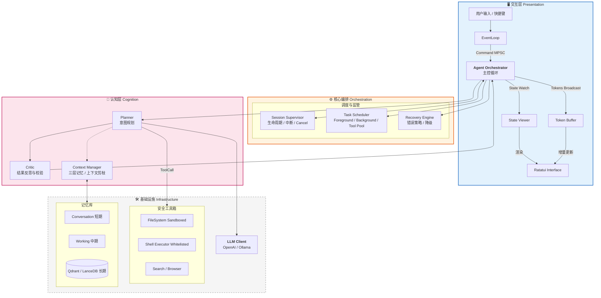

# Rust 个人智能体系统 (Bee) - 架构设计白皮书

## 1. 核心设计理念

本系统（代号 **Bee**）旨在构建一个高性能、安全且具备长期记忆的个人智能体。设计遵循以下原则：

1. **Rust Native**：充分利用 Rust 的所有权模型（Ownership）保证内存安全，利用 Tokio 实现高并发 I/O。
2. **Safety First**：工具执行层必须具备沙箱隔离，杜绝 AI「幻觉」导致的系统性破坏。
3. **Responsiveness**：UI 渲染与 AI 推理彻底解耦，确保在繁重的推理任务中界面依然流畅。
4. **Cognitive Loop**：采用 `Plan -> Act -> Observe -> Critic` 的增强型 ReAct 循环，提升解决复杂任务的能力。

---

## 2. 系统架构图 (Enhanced Architecture)

我们引入了 **Session Supervisor**（会话监管）、**Task Scheduler**（任务调度）和 **Recovery Engine**（恢复引擎）来增强系统的稳定性与可控性。



---

## 3. 关键模块详细设计

### 3.1 核心编排 (Orchestrator) 与通信管道

UI 与 Core 之间通过三种 Channel 解耦，**Stream 与 State 分离**，避免 Token 洪水阻塞状态更新。

| 通道名称 | 类型 | 方向 | 用途 | 丢包策略 |
|----------|------|------|------|----------|
| `cmd_tx` | `mpsc::unbounded_channel` | UI -> Core | 用户指令 (Submit, Cancel, Clear) | 不可丢 |
| `state_tx` | `watch::channel` | Core -> UI | 完整状态快照 (UiState) | 只保留最新 |
| `stream_tx` | `broadcast::channel` | Core -> UI | LLM 生成的 Token 流 | 可丢弃（UI 卡顿时可跳帧） |

**数据结构定义 (Rust)：**

```rust
// UI 看到的「投影」状态，轻量且易于渲染
#[derive(Clone, Debug, Serialize)]
pub struct UiState {
    pub phase: AgentPhase,           // Idle, Thinking, ToolExecuting, Error
    pub history: Vec<Message>,       // 当前显示的对话记录
    pub active_tool: Option<String>, // 正在使用的工具名称
    pub input_locked: bool,          // 是否锁住输入框
}

// 核心持有的完整内部状态（不暴露给 UI）
pub struct InternalState {
    pub step: usize,
    pub retries: u8,
    pub context_tokens: usize,
    pub memory: MemoryManager,
    pub tool_box: ToolBox,
    pub llm_client: LlmClient,
    pub config: Config,
    pub cancel_token: CancellationToken, // 用户 Ctrl+C 时取消
    // ... 复杂类型，不易克隆
}

impl InternalState {
    pub fn project(&self) -> UiState { /* 投影 */ }
}
```

### 3.2 Session Supervisor 与 Task Scheduler

**Session Supervisor**：管理会话级生命周期，支持 `Cancel` / `Pause`，依赖 `tokio_util::sync::CancellationToken` 实现用户「Stop generating」。

**Task Scheduler**：将任务按优先级与类型分类调度：

| 任务类型 | 说明 | 并发策略 |
|----------|------|----------|
| Foreground | ReAct 主循环 | 串行 |
| Tool Execution | 工具调用 | 受限并行（如最多 3 个） |
| Background | Embedding、索引、总结 | 后台队列，不阻塞 UI |

```rust
use tokio_util::sync::CancellationToken;

#[derive(Clone, Copy, PartialEq, Eq, Hash)]
pub enum TaskKind {
    AgentStep,      // 前台
    ToolExecution,  // 可并行
    Background,     // 后台
}

pub struct Task {
    pub id: TaskId,
    pub kind: TaskKind,
    pub cancel_token: CancellationToken,
}
```

### 3.3 增强型 ReAct 循环 (Planner + Critic)

在标准 `Think -> Act -> Observe` 中插入 **Critic**，降低工具幻觉与死循环。

**流程：**

1. **Planner**：根据用户输入生成执行计划（JSON）。
2. **Tool Execution**：执行工具，获取 `Observation`。
3. **Critic**：在将 `Observation` 喂回 Planner 之前，进行一次轻量级 LLM 调用。
   - **Prompt**：*"用户想要 X，你刚才执行了工具 Y，结果是 Z。这个结果符合预期吗？如不符合，给出修正建议；如符合，输出 OK。"*
4. **Refinement**：若 Critic 给出修正建议，将其作为 Context 注入下一轮，防止 Planner 重蹈覆辙。

**实现建议：**

```rust
#[async_trait]
pub trait AgentRole {
    async fn run(&self, ctx: AgentContext) -> AgentOutput;
}

pub struct Planner;
pub struct Critic;
pub struct Executor;
```

### 3.4 三层记忆 (Memory)

| 层级 | 名称 | 内容 | 生命周期 |
|------|------|------|----------|
| **短期** | Conversation Memory | 最近 N 轮对话 | 单会话 |
| **中期** | Working Memory | 当前任务目标、已尝试方案、失败原因 | 单任务 |
| **长期** | Long-term Memory | 向量化知识、用户偏好 | 跨会话 |

在 Prompt 中显式区分，减少 LLM 重复犯错：

```
## Current Goal
{working_memory.goal}

## What has been tried
{working_memory.attempts}

## Relevant Past Knowledge
{long_term_retrieval}
```

### 3.5 错误恢复引擎 (Recovery Engine)

利用 Rust 的 `Result` 类型系统构建语义化恢复机制。

```rust
pub enum AgentError {
    NetworkTimeout,
    ContextWindowExceeded,
    JsonParseError(String),
    ToolExecutionFailed(String),
    ToolTimeout(String),
    HallucinatedTool(String), // LLM 调用了不存在的工具
}

pub enum RecoveryAction {
    RetryWithPrompt(String),
    SummarizeAndPrune,
    AskUser(String),
    DowngradeModel,
    Abort,
}

impl RecoveryEngine {
    pub async fn handle(&self, err: AgentError, history: &mut Vec<Message>) -> RecoveryAction {
        match err {
            AgentError::JsonParseError(raw) => {
                RecoveryAction::RetryWithPrompt(
                    format!("上一轮输出的 JSON 格式错误: {raw}。请修正。")
                )
            }
            AgentError::ContextWindowExceeded => RecoveryAction::SummarizeAndPrune,
            AgentError::HallucinatedTool(name) => {
                RecoveryAction::AskUser(
                    format!("模型试图调用不存在的工具 '{name}'，是否需要安装或跳过？")
                )
            }
            AgentError::ToolTimeout(_) => RecoveryAction::AskUser("工具执行超时，是否重试？".into()),
            _ => RecoveryAction::Abort,
        }
    }
}
```

### 3.6 工具沙箱 (Sandboxed Tooling)

| 工具 | 安全策略 |
|------|----------|
| **FileSystem** | 封装 `SafeFs`，初始化时绑定 `root_dir`，所有路径通过 `path.strip_prefix(root_dir)` 校验，禁止 `../../ssh/id_rsa` |
| **Shell** | 维护 `AllowList`，仅允许 `ls`、`grep`、`cargo check` 等，禁止 `rm -rf`、`wget`、`chmod` |
| **Search/Web** | 域名白名单、请求超时、结果大小限制 |

**通用要求**：每工具独立 `timeout`（默认 30s）、审计日志记录每次调用。

---

## 4. 技术栈选型 (BOM)

| 模块 | 推荐库 | 版本要求 | 选择理由 |
|------|--------|----------|----------|
| **Runtime** | `tokio` | 1.35+ | 事实标准，features = ["full"] |
| **Cancel** | `tokio_util` | 0.7+ | `CancellationToken` 支持用户中断 |
| **TUI** | `ratatui` | 0.28+ | 现代、社区活跃，组件丰富 |
| **Input** | `crossterm` | 0.27+ | 跨平台终端事件 |
| **LLM** | `async-openai` | 0.20+ | 类型完善，支持 Stream |
| **JSON** | `serde_json` + `schemars` | 1.0+ | 自动生成工具 Schema |
| **Config** | `config` | 0.14+ | TOML/YAML/Env 分层配置 |
| **Logs** | `tracing` + `tracing-appender` | 0.1+ | 异步非阻塞，结构化输出 |
| **Vector** | `qdrant-client` | 1.9+ | Rust 原生，支持本地模式 |
| **Error** | `thiserror` / `anyhow` | - | 库用 thiserror，应用用 anyhow |

---

## 5. 目录结构建议

```
bee/
├── Cargo.toml
├── config/
│   ├── default.toml
│   └── prompts/
│       ├── system.txt
│       ├── tool_calling.txt
│       └── critic.txt
├── src/
│   ├── main.rs
│   ├── lib.rs
│   ├── ui/                      # 交互层
│   │   ├── mod.rs
│   │   ├── app.rs
│   │   ├── event.rs
│   │   └── render.rs
│   ├── core/                    # 核心编排
│   │   ├── mod.rs
│   │   ├── orchestrator.rs
│   │   ├── session_supervisor.rs
│   │   ├── task_scheduler.rs
│   │   ├── state.rs             # InternalState + UiState
│   │   ├── error.rs
│   │   └── recovery.rs
│   ├── react/                   # 认知层
│   │   ├── mod.rs
│   │   ├── planner.rs
│   │   ├── critic.rs
│   │   ├── memory.rs            # 三层记忆协调
│   │   └── loop.rs
│   ├── llm/
│   │   ├── mod.rs
│   │   ├── trait.rs
│   │   ├── openai.rs
│   │   └── ollama.rs
│   ├── tools/
│   │   ├── mod.rs
│   │   ├── executor.rs
│   │   ├── filesystem.rs
│   │   ├── shell.rs
│   │   └── search.rs
│   ├── memory/                  # 记忆存储
│   │   ├── mod.rs
│   │   ├── conversation.rs
│   │   ├── working.rs
│   │   ├── long_term.rs
│   │   └── persistence.rs
│   └── observability/
│       ├── mod.rs
│       └── tracing.rs
└── docs/
    └── Rust个人智能体系统(Bee)-架构设计白皮书.md
```

---

## 6. 开发路线图 (Phased Implementation)

### Phase 1: 骨架与大脑 (The Brain)

- **目标**：通过 CLI 与 LLM 对话
- **任务**：
  - 搭建 Tokio Runtime
  - 实现 `async-openai` 基本调用
  - 实现流式 Token 处理 (`StreamExt`)

### Phase 2: 身体与交互 (The Body & UI)

- **目标**：可用的 TUI 界面
- **任务**：
  - 集成 Ratatui
  - 实现 Command、State、Stream 三个 Channel 的异步循环
  - 实现 Markdown 渲染组件

### Phase 3: 工具与 ReAct (The Hands)

- **目标**：能读文件并回答代码相关问题
- **任务**：
  - 定义 `Tool` Trait
  - 实现 `Cat`、`Ls` 等沙箱工具
  - 编写 System Prompt，使 LLM 输出 JSON Tool Call
  - 实现 Tool 解析与执行逻辑

### Phase 4: 记忆与鲁棒性 (The Memory)

- **目标**：跨会话记忆、少崩溃
- **任务**：
  - 实现 `ConversationHistory` 持久化
  - 集成 `RecoveryEngine` 处理 JSON / 超时等错误
  - 添加 Planner + Critic
  - 添加 `tracing` 日志

### Phase 5: 进阶与扩展 (The Evolution)

- **目标**：向 Agent Runtime 演进
- **任务**：
  - 三层记忆 + Vector DB
  - Headless 模式（CLI / HTTP API）
  - Task Scheduler + 用户 Cancel
  - 配置热更新、多 LLM 后端切换

---

## 7. 总结

本架构设计面向**稳定、安全、可扩展**的 Agent Runtime，而非一次性玩具。其核心能力在于：

1. **并发模型**：UI 不卡顿，Stream 与 State 分离，后台多任务并行
2. **安全沙箱**：敢让 Agent 执行本地操作
3. **类型系统**：在编译期捕获大部分逻辑错误（如状态机非法流转）
4. **可演进性**：目录与模块划分可支撑至 Phase 5（本地 Agent OS、任务队列、定时触发）

> 这不是「写个 Agent 玩玩」的设计，而是 **一个 Rust 原生 Agent Runtime 的蓝图**。
